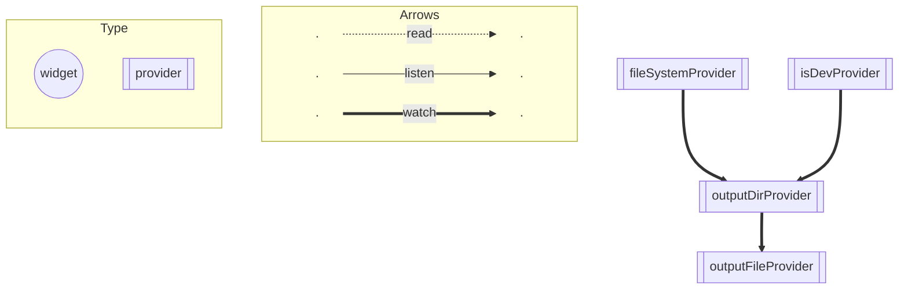

## はじめに

みなさん、Flutter で開発をするとき Riverpod を使っていますか？
ゆめみでは Riverpod を標準パッケージとして、基本的に全てのプロジェクトで使っています。

https://pub.dev/packages/riverpod

ご存知の方も多いとは思いますが、実は Flutter 以外のプロジェクトでも Riverpod は使うことができます。

この記事では Dart CLI App 開発時に Riverpod を使ってみて、改めて便利だなと思った部分を少しだけ紹介します。

## 準備

紹介する前に Dart CLI App の基盤を作成します。
今回はファイルへの書き込みを行うだけの簡単なものを考えます。

### プロジェクトを作成する

公式ドキュメントに記載されているとおり、次のコマンドを実行してプロジェクトを作成します。

```shell
dart create -t console <app_name>
cd <app_name>
```

https://dart.dev/tutorials/server/get-started

この記事では <app_name> の部分を `demo` として進めていきます。

### Riverpod を導入する

公式ドキュメントに記載されているとおり、次のコマンドを実行して導入します。

```shell
dart pub add riverpod
dart pub add riverpod_annotation
dart pub add dev:riverpod_generator
dart pub add dev:build_runner
dart pub add dev:custom_lint
dart pub add dev:riverpod_lint
```

その後 `analysis_options.yaml` に次の内容を追加して `riverpod_lint` を有効にします。

```yaml:analysis_options.yaml
analyzer:
  plugins:
    - custom_lint
```

https://riverpod.dev/ja/docs/introduction/getting_started

### ファイル操作用のパッケージを導入する

ファイル操作用の便利なパッケージを Google さんが用意してくださっているので、次のコマンドを実行して導入します。

```shell
dart pub add file
```

https://pub.dev/packages/file

### 開発環境と本番環境を区別できるようにする

CLI App では公式ドキュメントに記載されているように、`--define` オプションを使用して環境を区別します。

https://dart.dev/guides/environment-declarations

毎回コマンドオプションを入力しなくて良いように VS Code の起動設定ファイルを次のように修正します。

```jsonc:.vscode/launch.json
{
  "version": "0.2.0",
  "configurations": [
    {
      "name": "dev",
      "request": "launch",
      "type": "dart",
      "program": "bin/main.dart",
      "args": [
        "--define=DEV=true",
      ],
    },
    {
      "name": "prod",
      "request": "launch",
      "type": "dart",
      "program": "bin/main.dart",
      "args": [],
    },
  ],
}
```

### 基本的な処理を書く

まずは Riverpod を利用せずにファイルへの書き込みを行う処理を書いてみます。

`output/hello.txt` に `Hello` と書き込まれるような処理にしてみます。

```dart:lib/demo.dart
import 'package:file/local.dart';

void runApp() {
  final fileSystem = LocalFileSystem();
  final currentDir = fileSystem.currentDirectory;
  final outputDir = currentDir.childDirectory('output');
  final outputFile = outputDir.childFile('hello.txt');
  if (!outputFile.existsSync()) {
    outputFile.createSync(recursive: true);
  }
  outputFile.writeAsStringSync('Hello');
}
```

```dart:bin/demo.dart
import 'package:demo/demo.dart';

void main(List<String> arguments) => runApp();
```

## 便利なところ

以上で準備完了です。
それでは Riverpod の便利なところを紹介していきます。

### テストが書きやすい

このままだと `LocalFileSystem` を使用しているため、テスト時に実際のファイルに書き込まれてしまい、テストがローカル環境に影響されてしまい不安定なテストになってしまいます。
この問題を解決するために Riverpod を使って `LocalFileSystem` を `MemoryFileSystem` に差し替えます。

まずは、いくつかプロバイダーを作成します。

```dart:lib/src/providers.dart
import 'package:file/file.dart';
import 'package:file/local.dart';
import 'package:riverpod_annotation/riverpod_annotation.dart';

part 'providers.g.dart';

@riverpod
FileSystem fileSystem(FileSystemRef ref) => const LocalFileSystem();

@riverpod
Directory outputDir(OutputDirRef ref) {
  final fileSystem = ref.watch(fileSystemProvider);
  return fileSystem.currentDirectory.childDirectory('output');
}

@riverpod
File outputFile(OutputFileRef ref) {
  final outputDir = ref.watch(outputDirProvider);
  return outputDir.childFile('hello.txt');
}
```

次のコマンドでプロバイダーを生成します。

```shell
dart run build_runner build
```

その後、`lib/demo.dart` を次のように修正します。

```dart:lib/demo.dart
import 'package:demo/src/providers.dart';
import 'package:riverpod/riverpod.dart';

void runApp() {
  final container = ProviderContainer();
  try {
    outputToFile(container);
  } finally {
    container.dispose();
  }
}

void outputToFile(ProviderContainer container) {
  final outputFile = container.read(outputFileProvider);
  if (!outputFile.existsSync()) {
    outputFile.createSync(recursive: true);
  }
  outputFile.writeAsStringSync('Hello');
}
```

このようにすることで、テスト時に `LocalFileSystem` を `MemoryFileSystem` に簡単に差し替えることができます。

```dart:test/demo_test.dart
import 'package:demo/demo.dart';
import 'package:demo/src/providers.dart';
import 'package:riverpod/riverpod.dart';
import 'package:test/test.dart';
import 'package:file/memory.dart';

void main() {
  late MemoryFileSystem memoryFileSystem;
  late ProviderContainer container;

  setUp(() {
    memoryFileSystem = MemoryFileSystem();
    container = ProviderContainer(
      overrides: [
        fileSystemProvider.overrideWithValue(memoryFileSystem),
      ],
    );
  });

  tearDown(() {
    container.dispose();
  });

  test('outputToFile() 実行後、指定のファイルに Hello が出力されている', () {
    // Arrange
    final outputFile = container.read(outputFileProvider);
    expect(outputFile.existsSync(), isFalse);

    // Act
    outputToFile(container);

    // Assert
    expect(outputFile.existsSync(), isTrue);
    expect(outputFile.readAsStringSync(), 'Hello');
  });
}
```

### 環境によって影響受ける処理が分かりやすくなる

CLI App では検証を簡単にするために、環境によって出力先を切り替えることが多々あるのではないでしょうか。

開発環境では `build` ディレクトリに出力し、本番環境では `output` ディレクトリに出力するような処理を書いてみます。

プロバイダー部分を少し修正するだけで簡単に実現できます。

```diff:lib/src/providers.dart
 part 'providers.g.dart';
 
+@riverpod
+bool isDev(IsDevRef ref) =>
+    const bool.fromEnvironment('DEV', defaultValue: false);
+
 @riverpod
 FileSystem fileSystem(FileSystemRef ref) => const LocalFileSystem();
 
 @riverpod
 Directory outputDir(OutputDirRef ref) {
   final fileSystem = ref.watch(fileSystemProvider);
-  return fileSystem.currentDirectory.childDirectory('output');
+  final isDev = ref.watch(isDevProvider);
+  final outputDirName = isDev ? 'build' : 'output';
+  return fileSystem.currentDirectory.childDirectory(outputDirName);
 }
```

プロバイダーの再生成もお忘れなく。

```shell
dart run build_runner build
```

このように、環境部分をプロバイダー化しておくと、テスト時の切り替えが簡単になるのはもちろん、`riverpod_graph` を使ってプロバイダーの依存関係図を生成した時に、環境によってどのプロバイダーが影響受けるのかが分かりやすくなります。



https://github.com/rrousselGit/riverpod/tree/master/packages/riverpod_graph

## おわりに

CLI App で Riverpod を使ってみましたが、改めて便利だなと思いました。

ぜひ、みなさんも Flutter プロジェクト以外で Riverpod を使ってみてください。
